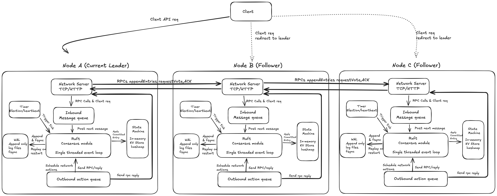

# Paxor [work in prog] 

Paxor is a distributed, replicated key-value database built from scratch to explore consensus, durability, and fault tolerance.

It implements a leader-based consensus protocol to ensure that multiple nodes behave as a single logical system by agreeing on a totally ordered log of operations.

Each node maintains a file-backed Write-Ahead Log (WAL) and applies committed entries to a deterministic state machine.

Paxor guarantees that once a write is committed by a majority of nodes, it will survive leader failures and node restarts.

the arch image 

